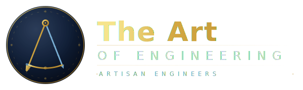

  

  <h2 align="center">ZERATH LABS</h2>

  

    A crew crafting ideas into digital masterpieces—code as art, not just logic.
     
     
    <a href="https://zerathlabs.com"><strong>Explore →</strong></a>
     
     
    <a href="https://zerathlabs.com">Website</a>
    ·
    <a href="https://github.com/your-org">GitHub</a>
    ·
    <a href="mailto:hello@zerathlabs.com">Contact</a>
  

  <!-- Optional badges -->
  

    
    
    
  

## 🌊 The Art of Engineering

At Zerath Labs, we don’t just build products.  
We shape ideas into living systems.

From a rough spark to a refined experience—  
every project is a journey.

## 🧭 Our Flow

- 🎨 Idea Sketching → shaping raw thoughts  
- 🖼️ First Canvas → the MVP, first form  
- 🧩 Brushstrokes → small refinements  
- 🚀 Next Arc → future evolution  
- 🏆 Grand Exhibition → final delivery  

## ⚔️ Who We Are

A guild of **Artisan Engineers**  
blending creativity with precision.

### Core Principles

- clarity over chaos  
- craft over shortcuts  
- systems that scale  

## 🌌 What Lives Here

This space holds:

- client projects  
- internal products  
- experiments  
- evolving blueprints  

Every repository = a piece of the craft.

## 🧩 Philosophy

> Crafted, not just built.
